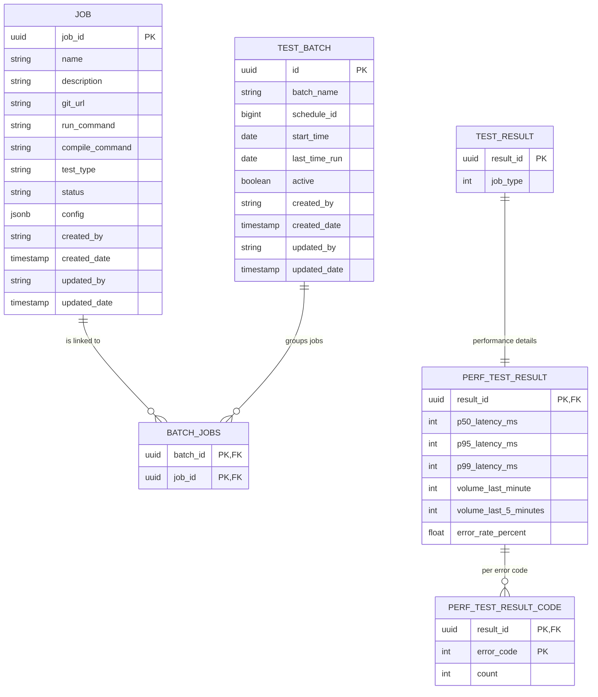

# Endpoint Insights

  

   

  
## Overview

Endpoint Insights is a performance and integration testing dashboard that we are building for our senior project.
Our client, VSP, is having us reimplement (from scratch) a dashboard that they used previously to schedule and execute api performance and integration testing.

**Client**: Vision Service Plan (VSP)

**Project Duration**: Fall 2025 - Spring 2026 (CSC 190/191)

## Key Features
### 1. Test Configurations:
   - Support a single test or you can batch tests together
   - Tests are configurable for their testing thresholds for performance testing
   - Tests can be for APIs, Integration testing, and UI testing
   - Schedule automated tests to run at certain times

### 2. Authentication and Authorization:
   - Single sign on via OpenID Connect
   - Support for role based access control which enables control over what users are allowed access to in the application

### 3. Email Notifications:
   - Emails the specified user a summary of tests performed and their configurations
   - Provides the user with a synopsis of important information from the tests completed
   - The emails will have color coordination for the test results so the user can quickly recognize the test performances

### 4. Comprehensive Results Summary:
   - Show the performance test result information
   - Highlight important parts of the results such as the maximum, minimum, and average response times
   - Shows what tests were performed, the duration of the tests, and who initiated the test

## Technology Stack

### Backend
- **Framework**: Spring Boot 4.0.0-M3
- **Language**: Java 25
- **Build Tool**: Maven 3.9+
- **Database**: PostgreSQL 17
- **ORM**: Spring Data JPA with Hibernate
- **Testing**: JUnit 5
- **Code Coverage**: CodeCov

### Frontend
- **Framework**: Angular 20.3.0+
- **Language**: TypeScript 5.9.2
- **Build Tool**: Angular CLI 20.3.6
- **UI Libraries**: Angular Material 20.2.9, Bootstrap 5.3.6, ng-bootstrap 19.0.1
- **Testing**: Karma 6.4.0, Jasmine 5.9.0

### DevOps & Infrastructure
- **CI/CD**: Jenkins
- **Version Control**: Git + GitHub

### Security & Authentication
- **Protocol**: OpenID Connect (OIDC)
- **Authorization**: JWT with Bearer tokens
- **Session Management**: Stateless
- **Identity Provider**: External IdP (production)

## Architecture

**architecture diagram ehre**

The system consists of:
- Frontend
- Backend
- Database
- Authentication: Authelia for testing (client uses something else)
- CI/CD: Jenkins + CodeCov

## General Application Flow
### Creating and Running a Test
1. User will authenticate against external identity provider
2. User will configure a new test with
    - a name
    - description
    - test project git URL
    - compile command
    - run command
3. User will add the new test to a list of multiple tests and configure pass/fail thresholds for the tests
4. User will specify a schedule to run a single or batch of tests
5.  When the test is scheduled to run:
     - pull git repository
     - builds the test suite
     - runs the tests
     - interprets results
     - triggers alerts based on thresholds

 ## Application UI Visual
 
 
 
 
 

## Getting Started

Tests are run automatically on all first-party branches and pull requests. 

### Prerequisites
**Backend**:
- Maven (mvn)
- Java 25
- PostgresSQL 17

**Frontend**:
- Node.js v24+
- Node Package Manager (npm)

## Running Locally

### Backend
1. Configure the following environment variables: 

    | Environment Variable     | Description                                                      | Required |
    |--------------------------|------------------------------------------------------------------|----------|
    | DB_NAME                  | Username used for the db connection                              | **X**    |
    | DB_PASSWORD              | Password used for the db connection                              | **X**    |
    | DB_URI                   | URI in jdbc format to the db (including database name)           | **X**    |
    | OIDC_CLIENT_ID           | Client ID for OIDC authentication flow                           | **X**    |
    | OIDC_CLIENT_SECRET       | Client secret for authentication                                 | **X**    |
    | OIDC_ISSUER_URI          | Token issuer URI                                                 | **X**    |
    | OIDC_CLIENT_REDIRECT_URI | Redirect URI for the api call back when a user is authenticated. |          |

2. `cd endpoint-insights-api`
3. Run directly with a maven goal `mvn spring-boot:run` ***or*** build and run `mvn clean package` & `java -jar target/endpoint-insights-api-*.jar`
4. Run a quick health check: `curl localhost:8080/api/health`

### Frontend
1. Ensure [`endpoint-insights-api`](#running-locally) is running
2. `cd endpoint-insights-ui`
3. Install dependencies with `npm install`
4. Run with `ng serve`

## Testing

### Running Backend Tests
1. `cd endpoint-insights-api`
2. `mvn clean compile`
3. `mvn test`

### Running Frontend Tests
1. `cd endpoint-insights-ui`
2. `npm ci`
3. `npm run build`
4. `npm run test:ci`

### Test Coverage
Code coverage reposts are automatically generated and published to CodeCov when github actions are run.

## Deployment
TBD

## Entity Relationship Diagram (ERD)

## Contributing
### 1. Create a branch sourced from `develop`
  - Name your branch after your Jira story dedicated to the code implementation.
  - Example: `feature/EI-21`
  - Clone repo to local machine and target to new branch
### 2. Develop & Test
  - Implement code changes.
  - Run local unit tests to verify functionality.
    - Refer to [Testing](#testing)
### 3. Commit your changes
  - Each commit should include comments describing:
    - Related Jira story/subtask
    - The feature implemented or task completed
### 4. Create a Pull Request
  - Open a PR **into the `develop` branch** and include:
      - Related Jira story
      - Feature or task implemented
### 5. Address Code Review Requests
  - Commit any updates requested by Code Reviewer(s).
### 6. Merge & Cleanup
  - Once approved and all tests are passing, merge branch into `develop`.
  - Delete branch after merge.

## Timeline for Completion

## Timeline for Completion

## Documentation

For detailed information about the system architecture, deployment, and authentication:

**[View Full Documentation](docs/index.md)**

## Contributors

- Brynn Crowley
- Nicholas Cooper
- Tyler Mains
- Caleb Brock
- Marcos Pantoja
- Daniel Carello
- Cardell Rankin
- Jino Enriquez
